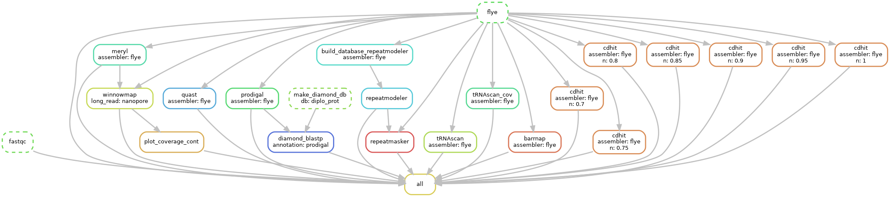

# GenoDiploBasic: A Simplified GenoDiplo Pipeline for *Spironucleus barkhanus*

[](https://opensource.org/licenses/MIT)


## Overview

The implementation of the Snakemake workflow management system revealed the need for custom adjustments and the integration of additional software for each genome project. Managing command-line tools sequentially introduced significant repetitive tasks, making it challenging to maintain comprehensive records and reproduce results. The project structure frequently evolved based on final outcomes, emphasizing the importance of reproducibility for efficient time management and keeping the project current for future advancements.

## GenoDiploBasic Pipeline



The GenoDiplo pipeline was initially tailored for the large diplomonad genome of *H. inflata*, characterized by sparse introns. However, the pipeline's structure is adaptable for other genome projects with the incorporation of additional software tools. In this study, a simplified version of the GenoDiplo pipeline was applied to *S. barkhanus*.

## Genome Assembly

The GenoDiploBasic pipeline focused on genome assembly using only Nanopore long reads, excluding Illumina polishing and contamination processes due to the bacteria-free cultivation of *S. barkhanus*. Nanopore reads, being long and accurate, facilitated a compact assembly given the genome size compared to *S. salmonicida*. 

## Gene Prediction and Functional Annotation

### Gene Prediction

The genome annotation pipeline was based on custom workflows previously applied to other diplomonad genomes. For *S. barkhanus*, annotation was performed using GlimmerHMM, which was trained on *S. salmonicida*, in conjunction with Prodigal for prokaryotic gene prediction to compare single-exon genes. To ensure consistency with previously assembled genomes, we initially conducted structural annotation using both GlimmerHMM and Prodigal. However, due to the complexities involved in installing and configuring GlimmerHMM, we ultimately chose to rely solely on Prodigal for future genomic analyses, even though it is known to slightly overpredict gene numbers. These potentially overpredicted genes will be addressed through subsequent functional annotations.
### Functional Annotation

The functional annotation pipeline followed a hierarchical approach, similar to the GenoDiplo pipeline used for *H. inflata*. The process started with sequence similarity searches across various diplomonad genomes and transcriptomes, such as *Trepomonas*, and proceeded with InterProScan to identify functional genes that were not previously annotated in diplomonad genomes. Additionally, tRNA, rRNA, and RepeatMasker were utilized to annotate the non-coding regions of the genome. However, the GenoDiploBasic pipeline begins with a DIAMOND BLAST search across all available diplomonad genomes. The remaining functional enrichment steps were separated due to the requirement for external databases, which necessitate local software installations and database access outside of the typical Conda environments.
## Getting Started

### Prerequisites

- Snakemake

### Installation

Clone the repository:

```bash
git clone https://github.com/yourusername/GenoDiploBasic.git
cd GenoDiploBasic
```

Install the required dependencies:

```bash
# Example for installing dependencies
conda env create -f environment.yml
conda activate GenoDiploBasic
```

### Usage

Run the pipeline:

```bash
snakemake --cores <number_of_cores>
```

Customize the configuration file (`config.yaml`) to match your project requirements.

## Contributing

Contributions are welcome! Please submit a pull request or open an issue to discuss your ideas.

## License

This project is licensed under the MIT License - see the [LICENSE](LICENSE) file for details.
